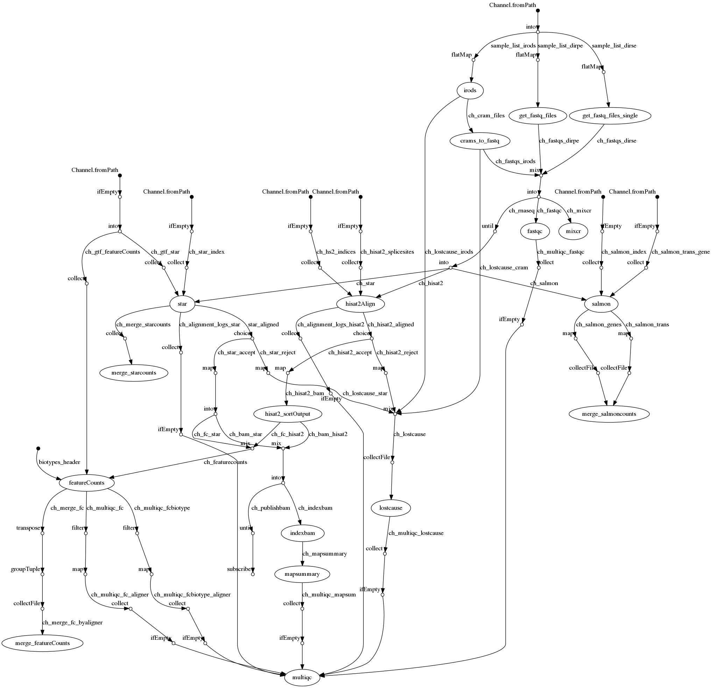

# RNAseq pipeline

### Introduction

cellgeni/rnaseq is a bioinformatics analysis pipeline used for RNA sequencing data at the
[Cellular Genetics program](http://www.sanger.ac.uk/science/programmes/cellular-genetics)
at [the Wellcome Sanger Institute](http://www.sanger.ac.uk/).

The pipeline uses [Nextflow](https://www.nextflow.io), a bioinformatics
workflow tool. Input may be CRAM files from IRODS storage or fastq files from
an input directory. In both cases a sample file with a list of sample IDs is
used to associate a single primary identifier with a sample.

In its primary mode the rnaseq pipeline performs four main tasks; read
alignment, quality control, feature counts, and merging of gene counts and/or
transcript counts.  Three aligners can be used: STAR, hisat2, and
salmon. It is possible to run any subset of these.

Count matrices for both STAR and hisat2 are created using featureCounts.
For salmon merged count matrices are created directly from its outputs,
and additionally a count matrix is created from gene counts produced by STAR itself.

A secondary mode is the ability to run [mixcr](https://mixcr.readthedocs.io/en/master/).
It can be run concurrently or independently
from the primary rnaseq mode. We envision that other modes will be added
to this pipeline in a similar manner.

This pipeline is primarily used with an LSF cluster and an OpenStack private
cloud. However, the pipeline should be able to run on any system that Nextflow
supports. See the [installation docs](docs/installation.md) for more
information.

### Documentation
The RNAseq pipeline comes with documentation about the pipeline, found in the
`docs/` directory.

### Credits
This pipeline was forked from the amazing [nf-core/rnaseq](https://github.com/nf-core/rnaseq/)
pipeline, originally developed at the [National Genomics
Infrastructure](https://portal.scilifelab.se/genomics/) at
[SciLifeLab](http://www.scilifelab.se/) in Stockholm, Sweden by Phil Ewels
([@ewels](https://github.com/ewels)) and Rickard Hammarén
([@Hammarn](https://github.com/Hammarn)).

Our pipeline has diverged in a few ways, as described below. It still closely
resembles the nf-core pipeline in the sense that processes look similar or
are virtually identical. Most changes are either the removal or addition of a
process, or a reworking of the pipeline plumbing. This is testament to how
nicely Nextflow isolates process logic and definitions from workflow
orchestration.

- Support for running on Kubernetes was added, using Docker containers. We adhere to
  a strict one-process one-container mapping, where possible using off-the shelf
  [biocontainers](https://quay.io/repository/biocontainers/).

- Integration of IRODS input was added. This introduced two processes: pulling the data from
  IRODS and converting cram files to fastq files.

- We use the sample ID as the primary process ID and tag everywhere.

- The building of indexes was split off into a separate file `buildindex.nf`. This file
  still needs a lot of work to recover from the splitting step.

- All code was pulled out of conditional statements, enabling us to run different
  modes at the same time. This is helpful for testing, reduces overhead, and reduces
  the barrier to using different modes.

- [mixcr](https://mixcr.readthedocs.io/en/master/) was added as additional mode.

- We've added *lost cause* channels, tracking which samples are lost at what stage of
  the pipeline, if any. A lost cause section will be present in the MultiQC report
  if a sample was disregarded, for example because of low mapping percentage.

### Diagram
This is the flow chart of the pipeline.

